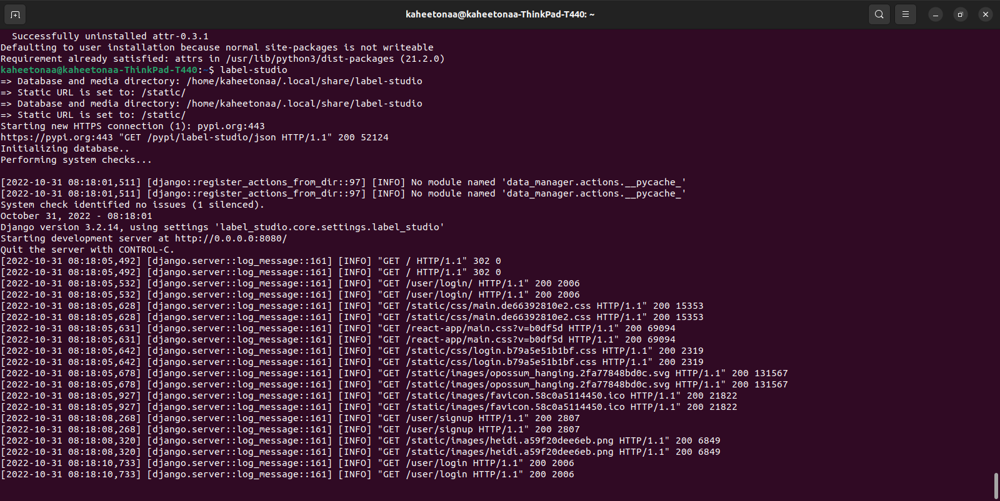

# PanoraMap(Pan-O-rama  project)
</em>A project for Urban landscape assessment using crowdsourced geodata </em>

Wiki: https://github.com/kaheetonaa/Pan-O-rama.wiki 

Presentation: https://docs.google.com/presentation/d/1QTvAqIEw_X0f9hi4JYJbacVpvqu1IW7LEpg4G0sJ9YI/edit#slide=id.g16e523f8eaa_0_5

## Installation
### Label Studio
Firstly, install "Label Studio" by following official instruction at [Label Studio Community Version Installation](https://labelstud.io/guide/install.html)  
Label Studio can be installed both by pip and Docker. 

After installing, run Label Studio. If using pip, run  
``label-studio``

Label Studio should be start at port 8080

### Ngrok
Install Ngrok through official instruction in [Ngrok installation instruction](https://ngrok.com/download)  
Distribute Label studio by typing  
``ngrok http 8080``

## Building Framework

## Testing Framework

